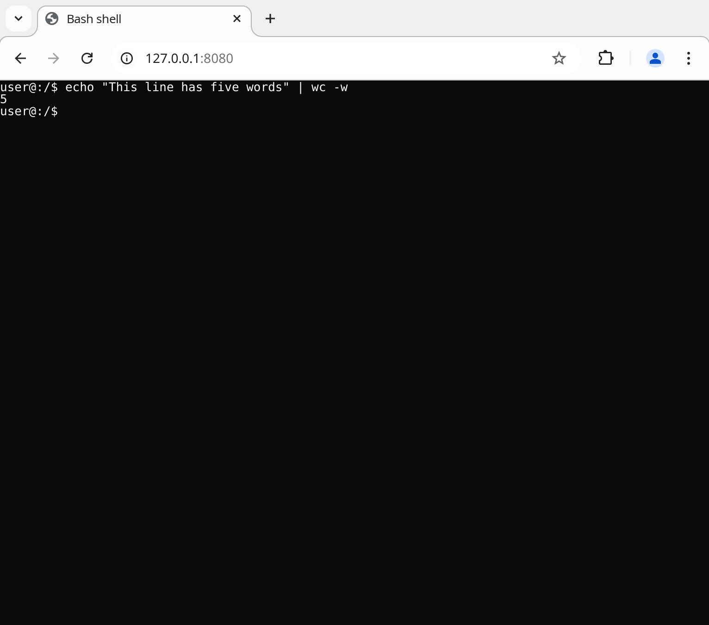
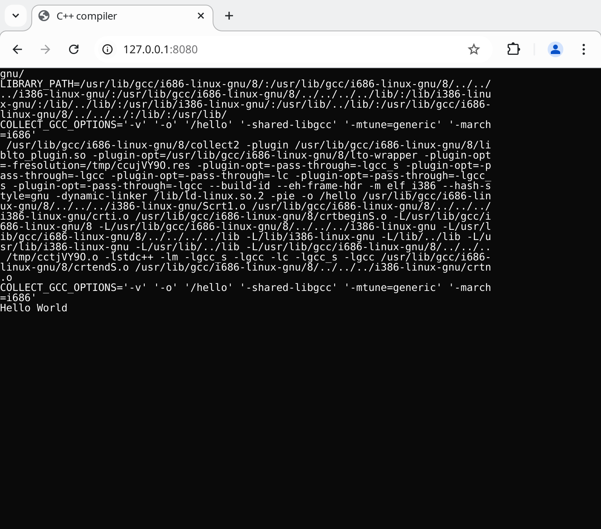
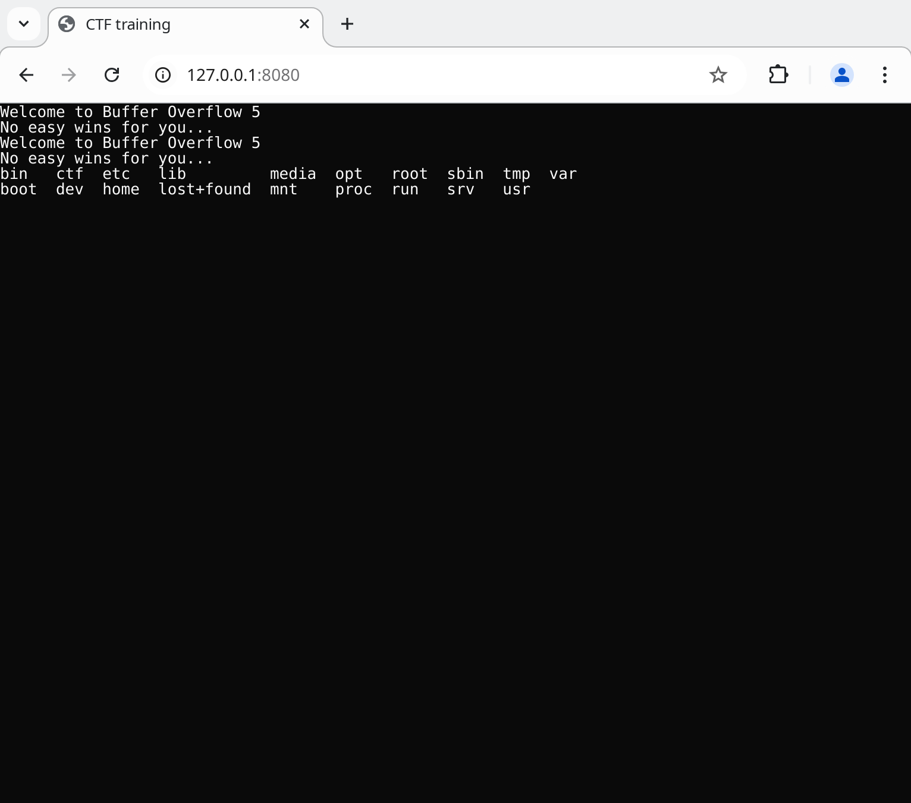
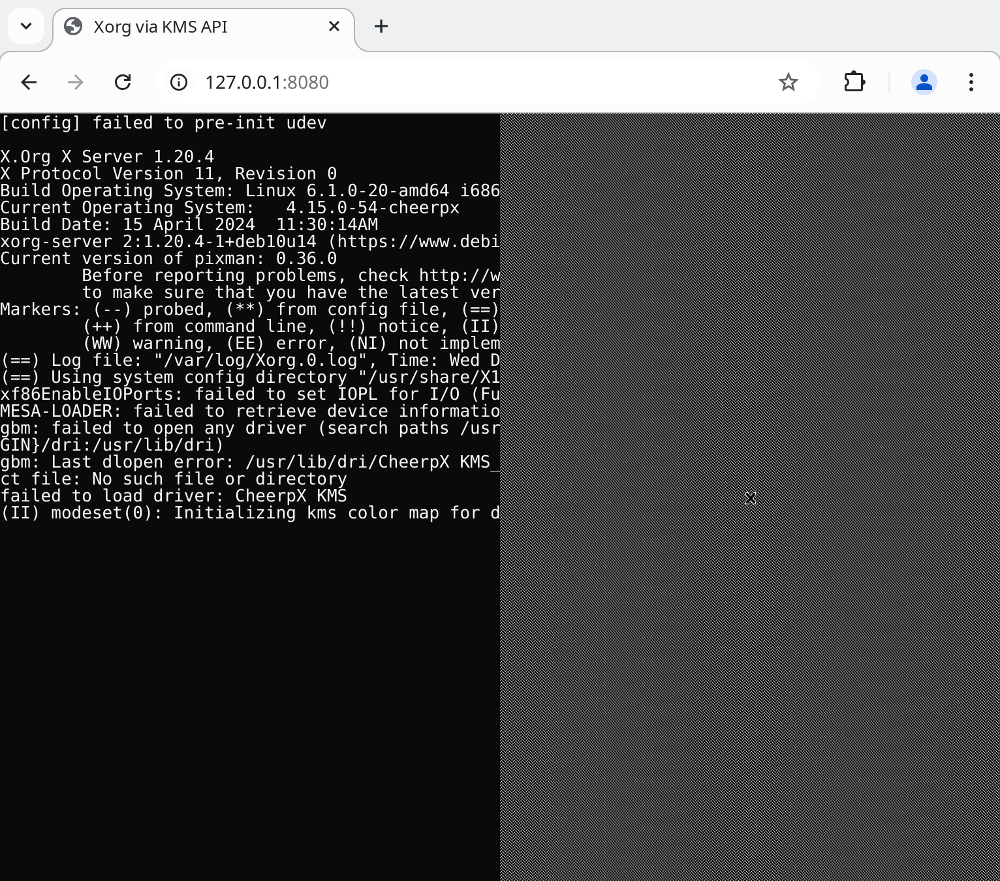
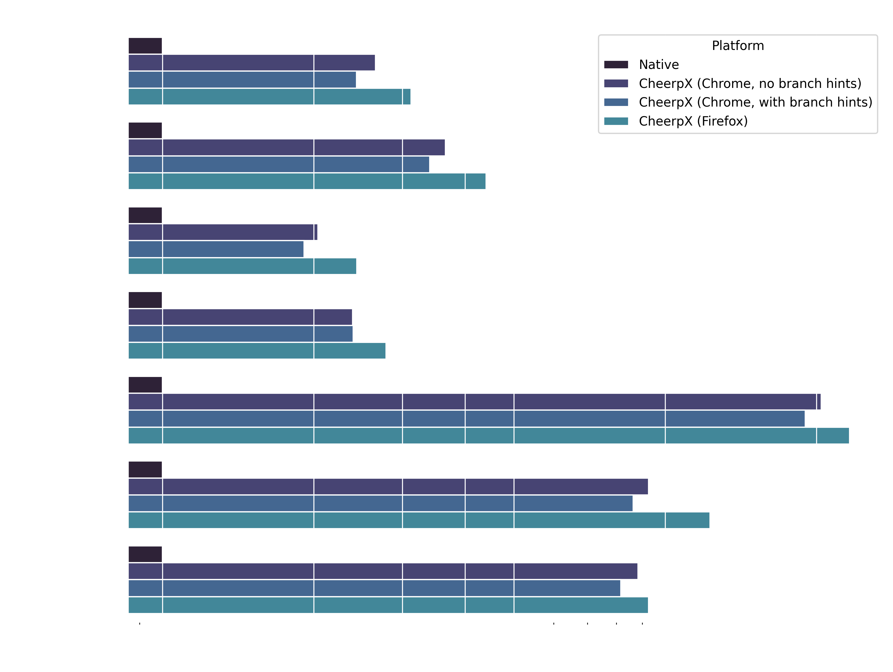

CheerpX is a WebAssembly-based virtualization engine for x86 binaries. It is built on top of standard Web technologies, and runs fully in the browser, with no need for server side execution of any sort.

Today, we are happy to release version 1.0 of CheerpX, the first stable release for this technology, with a [simple yet powerful API](https://cheerpx.io/docs).

Our amazing team has been working on CheerpX for many years, and used it to power a few of our most successful projects, including [CheerpX for Flash](https://leaningtech.com/cheerpx-for-flash/): a solution to run Flash applications in-browser and, most recently, [WebVM](https://webvm.io), which was extraordinarily well received by the community.

<video controls autoplay loop muted playsinline>
	<source src="./alpine-mines.mp4" type="video/mp4" />
</video>

The success of these projects, together with a new streamlined API, give us confidence that CheerpX is robust and ready for real-world use.

CheerpX is free to use for personal and open source projects. Licensing is required for development of commercial software and for any business use, with generous allowances and scalable models for small businesses. More information on licensing and self-hosting are on our [Licensing](https://cheerpx.io/docs/licensing) page.

## Why?

CheerpX makes it possible to build a new generation of Web applications which include binary components, developed in any programming language, while keeping their execution completely client-side.

Some obvious advantages of client-side execution are the protection of user privacy, the inherent scalability, reduction of operational costs and increased reliability. Beyond this, we see CheerpX as an enabling technology for the future of web development, and are excited to see where the limits of browser-based applications will be pushed.

Of course, WebAssembly can already be used to compile existing code to run in the browser, but this really applies only to “supported” programming languages, mainly C / C++ / Rust / Go, that are equipped with adequate tooling and SDKs, and to code bases for which the entire source code is available (a severe limitation for most enterprise software).

Moreover, even if an application is written in one of these languages, this does not mean it can _actually_ run in the browser using WebAssembly, as there still remains a major gap between the language being supported, and the platform APIs being supported.

CheerpX aims to be a universal solution to close this gap, by enabling the execution of unmodified x86 binaries, and bridging the platform API to HTML5. These capabilities, combined with its high performance, makes it possible to run any existing application, library or service client-side as part of a Web application.

## How does it work?

CheerpX is conceptually similar to other virtualization-in-the-browser solutions, like _v86_ or _jslinux_, but thanks to a combination of features can achieve much better performance, robustness and scalability.

We believe CheerpX to be the only solution in the market that makes it practical to run real-world binary applications and libraries in the browser.

The main enablers for this results are:

- **Execution Engine:** CheerpX features a multi-tier execution engine, with a fast interpreter that can also track the structure of running code with low overhead, and an advanced JIT engine that can generate high quality optimized WebAssembly code on the fly. The engine is extremely robust and supports dynamically generated and self-modifying code. For binaries that only use the most optimized parts of the instruction set, the slowdown can be [as low as 2x/3x compared to native](#benchmarks).

- **Linux syscall implementation:** CheerpX does not run the Linux kernel itself, but provides an extended set of Linux-compatible system calls. This means that the system is not a black-box, but CheerpX has a complete view of all the processes and threads currently executing. In particular, JavaScript code can start a specific program and wait for its completion by using the CheerpX APIs. This allows for a new integration paradigm for native code execution in Web apps, with binary payloads being directly driven by JavaScript logic.

- **Large disk images:** CheerpX supports large disk images, up to 2GB, which is a requirement to be able to run complete Linux distributions. All disk data is downloaded on demand and locally cached via IndexedDB. This local cache also doubles as completely private and persistent storage for any user modification. Any standard compliant HTTP server can be used as the backend, with support for HTTP byte ranges being the only requirement. An advanced backend based on Cloudflare, designed for [WebVM](https://webvm.io), is also available.

- **Networking via Tailscale**: Access to the Internet is supported via Tailscale, which makes it possible to connect browser tabs to your private VPN via WebSockets. Integrating with Tailscale is, by far, the best solution to provide Web applications with connectivity to the wider internet and we plan to open-source our complete networking stack in the following months to allow other projects to adopt the same solution. For more information about the rationale for choosing Tailscale see our recent post on the [architecture of WebVM](/blog/webvm-20).

## API overview

CheerpX exposes a simple, but powerful, [JavaScript API](https://cheerpx.io/docs). The following short snippet is sufficient to run a static binary in your browser.

```javascript
// Initialize the CheerpX environment
const cx = await CheerpX.Linux.create();
// Setup the engine using an existing HTML element as the console
cx.setConsole(document.getElementById("console"));
// Run a program and wait for its completion
await cx.run("/hello_cheerpx", []);
```

The `hello_cheerpx` executable will be loaded from the HTTP server hosting the page, executed client-side and its output will be printed in the provided HTML element.

Using the HTTP server as the filesystem root it’s a convenient default for short examples and “hello worlds”, but this behavior is completely configurable. The virtual filesystem can be constructed by combining the following backends

- Disk images in the Ext2 format
- HTTP servers
- Persistent storage based on IndexedDB
- JavaScript allocated Uint8Arrays or Strings
- Internal filesystems, such as `proc`, `devpts`, etc

This snippet of code will start a complete interactive shell in your browser.

Complete self-contained code for this example, and all the later ones, is also available at our [GitHub repository](https://github.com/leaningtech/cheerpx-meta/tree/main/examples)

```javascript
// Create a read-only block device for a disk image stored on the HTTP server
const blockDevice = await CheerpX.HttpBytesDevice.create("/cheerpXImage.ext2");
// Make the block device read-write using a persistent IndexedDB overlay
const idbDevice = await CheerpX.IDBDevice.create("block1");
const overlayDevice = await CheerpX.OverlayDevice.create(
	blockDevice,
	idbDevice
);
// Initialize the CheerpX environment
const mountPoints = [
	// Use the disk image as the filesystem root
	{ type: "ext2", path: "/", dev: overlayDevice },
	// Add the required Linux pseudo-filesystem
	{ type: "devs", path: "/dev" },
	{ type: "devpts", path: "/dev/pts" },
	{ type: "proc", path: "/proc" },
];
const cx = await CheerpX.Linux.create({
	mounts: mountPoints,
});
// Setup the text console
cx.setConsole(document.getElementById("console"));
// Run the Bash shell in the browser
await cx.run("/bin/bash", []);
```

The shell will now start and show its prompt in the provided HTML element. The user can type commands and run them as expected with no further changes to the JavaScript code.



The binary code for the shell, and any library the shell uses, is loaded on demand from the disk image. This is implemented using HTTP byte ranges and makes it possible to support large disk images, including complete Linux distributions, without requiring the user to download large amounts of data on the first access. Any downloaded chunk, and any user modification, is stored locally to the IndexedDB overlay, which acts both as a caching-layer and as privacy-preserving persistent local storage for user data..

Disk images can be customized arbitrarily and conveniently built from Dockerfiles. For full information see our [Custom image guide](https://cheerpx.io/docs/guides/custom-images)

## What can I do with CheerpX?

Combining the `run` API and the flexible mount point capabilities of CheerpX give superpowers to Web applications, with endless possibilities. Here is a small selection of practical use cases that can be built with just a few lines using CheerpX APIs.

Want to further experiment on one of these use cases? Each one is also available as a standalone complete example [in our repo](https://github.com/leaningtech/cheerpx-meta/tree/main/examples) with detailed instructions on how to get them to work locally.

### Use case: A REPL for Python

A complete REPL for Python, or any other programming language, can be achieved very quickly on top of the previous [basic example](#api-overview).

```javascript
...
const cx = await CheerpX.Linux.create({mounts: mountPoints});
// Setup the text console
cx.setConsole(document.getElementById("console"));
// Run the Python REPL in the browser
await cx.run("/usr/bin/python3", []);
```

That’s it. The user will now be able to try Python code in the browser. The basic _builtin console_ is sufficient for quick experimentation, but you should consider using the full-fledged [xterm.js](https://xtermjs.org/) terminal emulator for better results. You can do so using the [`cx.setCustomConsole` API](https://cheerpx.io/docs/reference/CheerpX-Linux-setCustomConsole)


## Use case: An environment to learn C++

Instead of writing code in a console, one can of course create a modern web UI and then use CheerpX to drive the execution of binaries from JavaScript.

This example will compile a C++ _hello world_ with the source code being provided as a JavaScript string.

```javascript
async function compileAndRun(cx, dataDevice, srcCode, inputName, outputName)
{
    // Make the source code available as a file
    await dataDevice.writeFile("/" + inputName, srcCode)
    // Compile the source code by calling g++
    await cx.run("/usr/bin/g++", ["-v", "/data/" + inputName, "-o", "/" + outputName], {
        env: [
            "PATH=/usr/bin"
        ]
    });
    await cx.run("/" + outputName, []);
}
const dataDevice = await CheerpX.DataDevice.create();
// Initialize CheerpX similarly to the previous examples,
// but include this extra entry in the mount points array
const mountPoints = [
  ...
  // Add the DataDevice to a known location
  { type: "dir", path: "/data", dev: dataDevice },
  ...
];
const srcCode = \`
\#include \<iostream\>

int main()
{
    std::cout \<\< “Hello World” \<\< std::endl;
    return 0;
}
\`;
await compileAndRun(cx, dataDevice, srcCode, “hello.cpp”, “hello”);
```

The output of the _hello world_ program will appear in the console when the binary is ready. For a more integrated experience you can convert the stdout to a string with the approach documented [here](https://cheerpx.io/docs/guides/input-output#custom-console).



## Use case: Hosting a HTTP server in the browser

CheerpX supports networking by integrating with [Tailscale](https://cheerpx.io/docs/guides/Networking), a private VPN service. In production you should let the user login to Tailscale interactively, but during development it might be convenient to use _Auth keys_ to connect to a testing Tailscale account.

First of all [generate an auth key](https://login.tailscale.com/admin/settings/keys), and pass it to CheerpX while initializing the environment.

```javascript
...
function netmapUpdateCb(map) {
  const currentIp = map.self.addresses[0];
  console.log(`Current IP address ${currentIp}`);
}
function stateUpdateCb(state) {
  if (state == 6 ) {
    console.log("Connected");
  }
}
const cx = await CheerpX.Linux.create({
  mounts: mountPoints,
  networkInterface: { authKey: "YOUR KEY", netmapUpdateCb, stateUpdateCb },
});
cx.networkLogin();
...
```

With this configuration CheerpX will automatically connect to Tailscale with the provided _Auth key_ and the assigned IP address will be printed in the browser console. Now we can start an HTTP server inside the virtual machine. The server will automatically list the contents of the root directory, but you can add an `index.html` to customize the result.

```javascript
...
await cx.run("/usr/bin/python3", ["-m", "http.server"]);
...
```

You can now reach this server from any device connected to Tailscale from a standard Web browser and even from other WebVM instances!

This latter case is especially interesting, since a Web developer can easily configure its own Tailscale account so that every user visiting a page is "connected" in a virtual network. In this scenario all the WebVM instances will be able to communicate via Tailscale, forming a completely browser hosted VPN.


## Use case: Organize a Capture-The-Flag competition

CTF competitions are often organized by the security community as a fun way of comparing skills or introducing newcomers to exploitation techniques. CheerpX can be used to create a safe and scalable environment for CTFs, by taking advantage of its ability of accurately executing unmodified binaries.

Any application exploit that works on native, will also work in CheerpX. This is an real-world example from the [University of Waterloo CTF S22 Contest](https://ctf.csclub.uwaterloo.ca/)

```javascript
...
// Add a device to expose a directory on the HTTP server in the VM
const webDevice = await CheerpX.WebDevice.create("/ctf");
// Initialize CheerpX similarly to the previous examples,
// but include this extra entry in the mount points array
const mountPoints = [
  ...
  // Mount the WebDevice to a known location
  { type: "dir", path: "/ctf", dev: webDevice },
  ...
];
// Setup the text console
cx.setConsole(document.getElementById("console"));
// Run the sample once with some input
await cx.run("/bin/bash", ["-c", "printf 'an unsuccessful attempt' | /ctf/chall5.bin"]);
// Run the sample again with input triggering a stack overflow
await cx.run("/bin/bash", ["-c", "printf 'AAAAAAAAAAAAAAAAAAAAAAAAAAAA\\xa0\\x83\\x04\\x08*\\x86\\x04\\x08P\\x86\\x04\\x08\\nls' | /ctf/chall5.bin"]);
```

Since CheerpX is a secure sandbox the user can confidently play with the challenges without any risk of corrupting his local system. A compelling UX could be built around the challenges by tracking the attempts of the user while providing real time scoring or hints if appropriate.



## Use case: Graphical applications

CheerpX supports the KMS Linux API, making it possible to run a complete Xorg server in the browser. Running Xorg is extremely convenient since it makes it possible for any Linux GUI app to run in CheerpX, independently of the toolkit. Using Qt, GTK+, or any other library makes no difference, since everything boils down to the X11 protocol. That said, the KMS support is generic and some toolkits support it directly as a backend, for example Qt.

To enable KMS support you need to provide CheerpX with a HTML5 canvas element using the [`setKmsCanvas` API](https://cheerpx.io/docs/reference/CheerpX-Linux-setKmsCanvas). The following example demonstrates how to do so.

```javascript
...
// Initialize CheerpX similarly to previous examples
// Setup the text console
cx.setConsole(document.getElementById("console"));
// Setup the KMS canvas with the desired resolution, assume `display` is a <canvas> element
cx.setKmsCanvas(document.getElementById("display"), 1024, 768);
// Start Xorg
await cx.run("/usr/bin/Xorg", ["-retro"]);
...
```

The commands above will start an Xorg server with the “classic” stipple pattern and cursor. The `-retro` option is of course not required but it’s a simple way of demonstrating that Xorg is working as expected.



For an example of what can be achieved by combining a KMS with a complete distro, check out the [WebVM Alpine demo](https://webvm.io/alpine.html) booting into a fully fledged i3 desktop.

## Benchmarks

Not only does CheerpX achieve unprecedented flexibility in running binary applications as part of Web apps, but it does so while maintaining high runtime performance.

Thanks to a host of innovations in the field of dynamic binary translation, CheerpX is expected to run complex applications 5x-10x slower than native, with the slowdown being as low as 2x-3x for binaries that only stress the best optimized parts of the CheerpX execution pipeline.

We are confident that we will be able to reduce the performance gap much further, bringing the average application to be _at most_ 5x slower than native. We know this can be achieved since it’s a matter of bringing the same optimizations we have already implemented for the integer pipeline to both the floating point and vector pipelines, whose implementation is currently quite simple.



This set of basic benchmarks shows how well can CheerpX perform when dealing with purely integer-based real-world binaries. As a point of reference we also show the performance of a Box2D-based benchmark, which is floating point heavy and stresses the least optimized parts of the CheerpX compilation engine. Larger and more complex applications such as python and nodejs show instead the typical behavior of an application using a wide variety of instructions.

In the case of Chrome/Chromium the positive performance effects of [WebAssembly Branch Hinting](/blog/branch-hinting) are not yet available to everybody, but we expect them to be soon enabled by default since the feature is [officially standardized](https://webassembly.org/features).

CheerpX, although not yet perfect, already achieved a much higher level of performance compared to alternative solutions such as _v86_ and _jslinux_, while also offering a much more flexible API to integrate the execution of single programs inside Web apps. The current level of performance is already sufficient to run many applications of practical interest in the browser, and the range of what can be achieved will further increase as the technology matures.

## Try it now

CheepX is a sophisticated virtualization engine running in the browser, but at its core it’s really just a simple to use JavaScript/WebAssembly library.

Like any other JavaScript library it can be included in your projects either by directly referencing it in a script tag

```html
<script src="https://cxrtnc.leaningtech.com/1.0.7/cx.js"></script>
```

Using NPM is also supported

```
npm install @leaningtech/cheerpx@1.0.7
```

Our docs include a step-by-step [Quickstart guide](https://cheerpx.io/docs/getting-started) and multiple [Tutorials](https://cheerpx.io/docs/tutorials) to help you get your Web-based virtual machines up and running.

All the use cases discussed above are also available as [fully working samples](https://github.com/leaningtech/cheerpx-meta/tree/main/examples).

## What’s next

This first stable release of CheerpX is a major milestone in the development of this technology, and we are excited to see what the developer community will build with it!

After many months spent polishing the API and making the CheerpX virtualization engine rock solid, our team is now going to focus on expanding the use cases supported by CheerpX even further.

Our priorities are currently in three areas:

- **Running Windows applications via WINE:** We see the virtualization of Windows applications as one of the main drivers of adoption for CheerpX, not only for professional/business applications, but also for games, especially when paired with accelerated 3D graphics via WebGPU. This line of work will tie back into the [CheerpX Games Runner](https://chromewebstore.google.com/detail/cheerpx-games-runner-beta/kpjhccfibjgklihcmaddjecaenppaahg) extension, currently in Beta, to significantly expand the scope of supported games.

- **Support for Docker containers:** Starting existing containers in the browser, including exposing their services to the host web page, could allow a new generation of privacy-first Web applications, low-cost development environments and IDEs.

- **New “System mode”:** With CheerpX we have so far focused on running Linux user-space applications by implementing a Web-first version of Linux system calls, but we do plan to expand CheerpX to also support complete Operating Systems, including Windows, Android and “real” Linux kernels.

In the longer term CheerpX features will expand to support new architectures, with two main objectives

- **Support for 64-bit code**: Although most payloads are available, or can be build, for 32-bit targets, the vast majority of ready-made containers on Docker Hub is 64-bit based. This feature will allow truly seamless execution of any existing container in the browser.

- **Support for ARM**: This feature will open up vast new possibilities, with the main objective being running unmodified Android in the browser. Support for the growing set of ARM based docker containers will also be interesting.

## Conclusions

We hope you will find the release of CheerpX 1.0 as exciting as we do, and that you can see the enormous possibilities that this technology opens up to web developers.

CheerpX is free to use by individuals with any purpose, including open-source and commercial projects. Licensing options are available for organizations interested in building applications with CheerpX. Our [Licensing page](https://cheerpx.io/docs/licensing) covers all the details with examples of what falls under our free use policy.

While CheerpX is not open source software, we intend to keep the majority of current and future tools built with CheerpX as FOSS. This includes, for example, [WebVM](https://webvm.io) and the [CheerpX Games Runner](https://chromewebstore.google.com/detail/cheerpx-games-runner-beta/kpjhccfibjgklihcmaddjecaenppaahg) extension. Beside being complete and useful products in their own right, these tools double as testbeds to improve our technology and examples for what can be achieved with it.

For any question, you can find Leaning Technologies engineers, including myself, on [our Discord](https://discord.leaningtech.com). We are building a lively community, which recently passed the one thousand users mark. We are happy to provide guidance and support for any bug you might find in CheerpX.

You can also find us at the following links. See you soon, and enjoy our tech.

[X.com / Alessandro Pignotti](https://x.com/alexpignotti)

[X.com / Leaning Technologies](https://x.com/leaningtech)

[Leaning Technologies Labs](https://labs.leaningtech.com/)

[LinkedIn](https://www.linkedin.com/company/2739659/)

[Email](mailto:info@leaningtech.com)
