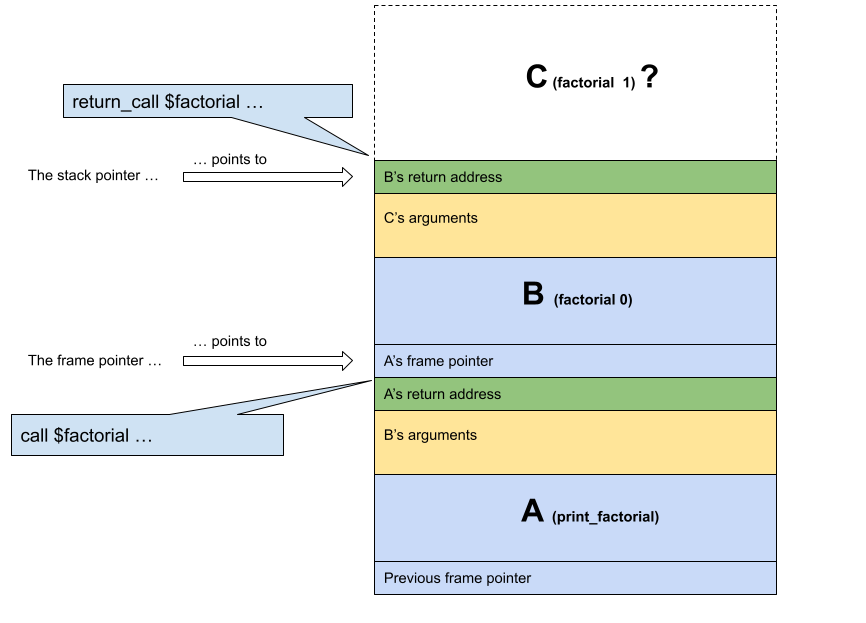
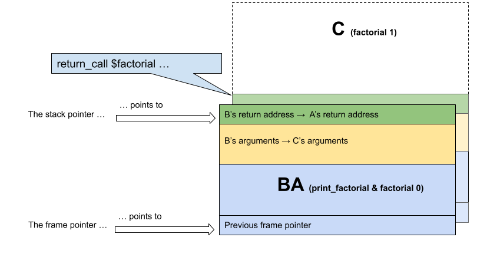
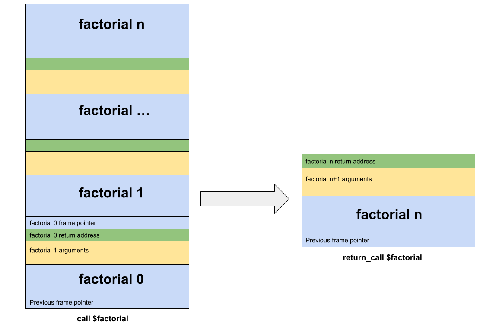
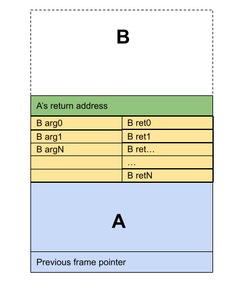
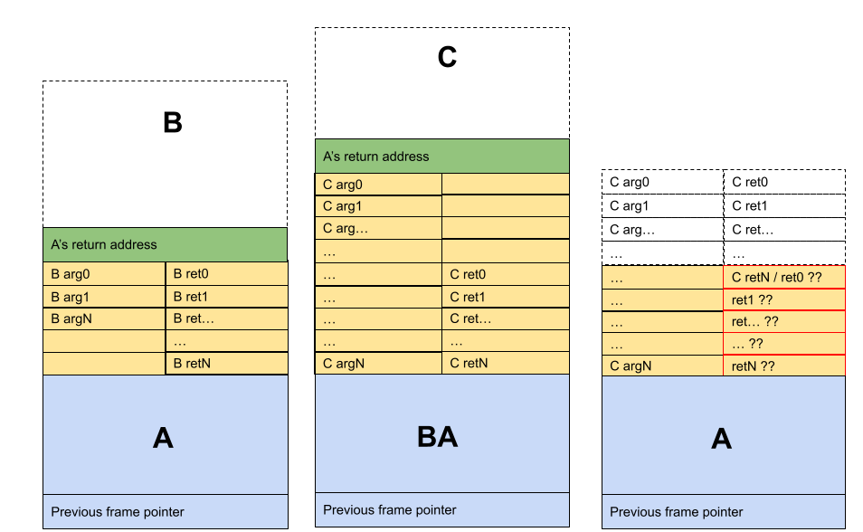
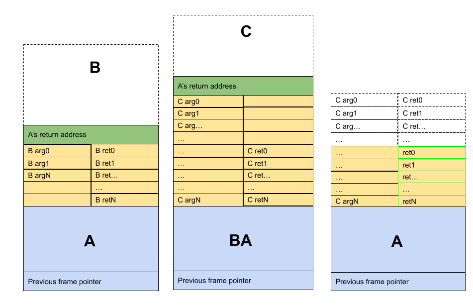

Recursion is one of the fundamental primitives of computer science. Many algorithms came to life by simplifying a general problem into recursive sub-problems. From the perspective of code, recursion implies that a function would call itself as part of its logic. Since stack is consumed for each instance of the function, excessive recursion depth will cause what is known as a stack overflow: a problem significant enough to become the namesake of the biggest programming Q&A platform on the planet!

If a recursive call happens to be in tail position (i.e. just before the function returns), this issue can be solved by using *tail recursion*. In this context, we could assume the caller’s stack frame can be reused before jumping into the callee, turning these calls into *tail calls*. This is a key concept in CPS (Continuation Passing Style), used by some functional programming languages where functions do not return but instead invoke a routine on their result, using tail calls to avoid exhausting the stack.

[WebAssembly](https://medium.com/leaningtech/extreme-webassembly-1-pushing-browsers-to-their-absolute-limits-56a393435323) is a modern bytecode that can be natively and efficiently run in browsers. It is designed to be a suitable compiler target for most other programming languages, including functional ones. Speed and efficiency being at the core of WebAssembly’s design, it is unsurprising that tail calls were [proposed as an extension to the standard.](https://github.com/WebAssembly/tail-call)

For a proposal to become a fully approved standard, a few steps are required, including being implemented by two different browser engines. V8, the engine used in Chrome and Edge, added support for WebAssembly tail calls in 2020. It was a step in the right direction, but since then, [the state of the proposal has been stagnating](https://medium.com/leaningtech/extreme-webassembly-2-the-sad-state-of-webassembly-tail-calls-f5d48ef82a87).

As Apple’s [Webkit already implements proper tail calls in ECMAScript 6](https://webkit.org/blog/6240/ecmascript-6-proper-tail-calls-in-webkit/#:~:text=What%20is%20a%20Proper%20Tail,is%20called%20a%20stack%20frame.).,), we thought it would be a good target to implement the feature and try to move the status of the proposal forward, eventually towards full standardisation.

**This article aims at demystifying WebAssembly tail calls while giving the reader an idea of how we have implemented the feature in WebKit.**

# Let’s refresh our memory…

There are different ways of representing function arguments at the machine level, these are named “calling conventions”. We will focus on how the call stack is allocated and how arguments are passed in JavaScriptCore, Safari’s JavaScript engine. Similar reasonings can apply to other environments.

The following C code shows a classic example of a tail-recursive solution to compute and print the factorial of a number.

Let’s focus on the first recursive call in `factorial`.

Two definitions are needed:

- The caller: `factorial 0`, the first instance of `factorial`.
- The callee: `factorial 1`, the first tail-recursive call to `factorial`.

To understand what happens at the machine level, we need to introduce two players: the frame pointer, which refers to the first byte of the current frame, and the stack pointer, which represents the top of the stack. Between them lies the data of our function. In JavaScriptCore, this would include stack values, virtual registers, local variables and the call frame header. The latter contains the state required to “return”, including the previous frame pointer and the caller’s instruction pointer.

Arguments are used to carry information from the caller to the callee. There are two ways of passing them: in registers or on the stack. The register approach is ideal since operations on them are much cheaper. This cannot be always done though, since we might have more values than registers available, in which case they will be “spilled” onto the stack. Managing stack space is one of the critical aspects of implementing tail calls.

When `factorial 0` calls `factorial 1`, we will first go through the callee’s prologue:

push $arg0 \\
push $arg... | caller’s frame (factorial 0)
push $argN |
call $factorial /
push %rbp \\
mov %rsp, %rbp | callee’s frame (factorial 1)

_Note: this is a tracing representation of pseudo assembly instructions in x86 AT&T syntax._

This grows the stack by the size of a register, and stores the previous frame pointer (`%rbp`). The return address is already written on the stack automatically by the CPU.

After that, anything can happen in the function as long as we reach the epilogue, symmetrically opposite:

push $arg0 \\
push $arg... | caller’s frame (factorial 0)
push $argN |
call $factorial /
push %rbp \\
mov %rsp, %rbp |
... | callee’s frame (factorial 1)
mov %rbp, %rsp |
pop %rbp |
ret /

The first instruction resets the stack pointer to the address of the previous frame. The `pop` instruction corresponds to the `push` in the prologue and it will restore the stack frame as it was before entering the callee, allowing the caller to access its local data again. `ret` will redirect the control flow using the address stored at the top of stack by the last `call` instruction, allowing us to go back to the caller’s frame.

If we call `factorial` with 1 as an argument, `factorial 1` ends the recursion and we go through two epilogues:

push $arg0 \\
push $arg... | caller’s frame (factorial 0)
push $argN |
call fib /
push %rbp \\
mov %rsp, %rbp |
... | callee’s frame (factorial 1)
mov %rbp, %rsp |
pop %rbp |
ret /
mov %rbp, %rsp \\
pop %rbp | caller’s frame (factorial 0)
ret /

This is wasteful and can be optimized. Here lies the concept of tail call elimination, through which we consider the callee as an extension of the caller.

# How it can be done in WebAssembly: return_call

The following shows the WebAssembly equivalent of our factorial example, with tail calls enabled.

In JavaScriptCore, WebAssembly would be first parsed and validated, then native code would be generated to delegate execution to the machine.

Since tail calls are a variant of regular calls, we could reuse most of the existing infrastructure in the engine. A new routine was added to prepare the frame before entering the callee’s prologue. These modifications do not require runtime gathered information, thanks to WebAssembly’s static typing.

Let’s examine the stack at `factorial 1` call site: the first time `factorial 0` recursively calls itself. For the sake of simplicity, we will abstract the call chain **print_factorial → factorial 0 → factorial 1** to **A → B → C**.

**Figure 1.** *The stack at C (factorial 1) call site.*

**B** contains the `return_call` instruction, so it must be responsible for adapting the stack. We don’t need its frame after it performs a tail call.

We will thus merge **B** and **A**, before jumping into **C**.

**Figure 2.** *The stack after rearrangement, before tail calling into C (factorial 1).*

Notice what changed in **B**’s data. We made sure **C** will return to **A**, by preserving the value that was pushed into the stack when **A** first called **B** (Fig. 1). Later on, we will make sure to start **C** with a `jmp` instruction instead of `call` to prevent the CPU from overwriting the saved return address.

While **C** is an extension of **B**, it still depends on information that **B** is responsible for. That is why we reused **A**’s stack space to store **C**’s arguments (Fig. 2). To carry this out, we needed to know how much stack slots **B** and **C** required. We could get that information by reasoning on the functions’ signatures during static analysis.

Fortunately, we didn’t have to worry about variable arguments, since they are not part of WebAssembly’s design. We could then compute a new stack offset, and copy what is needed from **B** to **A**.

Interestingly, from the perspective of **A**, we could say that **A** and **B** have been merged. At this point, we are ready to jump into **C**.

We will now compare a deeply recursive call to factorial, both with and without using `return_call`.

**Figure 3.** *Comparison of the stack in a deeply recursive routine.*

It becomes apparent that with `return_call`, we only use one frame for `factorial` and all potential recursions of it.

# Arguments vs. Return values

WebAssembly also supports multiple return values. This implies that the stack used by arguments equally stores the callee’s return values. This plays well with tail calls, since we can assume that **A** has enough space for **B**’s return values (Fig. 4). The tail calls specification also ensures that **B** can only tail call a function that returns the same number of values. However, this raises a concern regarding their offsets on the stack

**Figure 4.** *Stack at B call site. A reserved space for B’s return values*

The previous convention implemented by JavaScriptCore would prepare the frame as in Fig. 4, placing the return values closer to the stack pointer. With tail calls, we introduce the possibility of the frame being reused, which changes the size of the stack in case of a chain of calls with a varying number of arguments. In such a situation, **A** won’t be able to find the return values at the expected offsets (Fig. 5).

**Figure 5.** *Stack at different stages of the* **_A_** *->* **_B_** *->* **_C_** *tail call chain.* **_C_\***’s number of arguments modified the stack size of\* **_A_\***. Even if the return count was preserved with\* **_C_\***’s signature,\* **_A_** *expects the return values at incorrect offsets when* **_C_** \*returns.\*

This is due to the fact that offsets for stack values are computed statically when parsing code for a function. As a solution, we changed the convention to encode return values at the opposite side of the stack, closer to the caller’s frame pointer.

**Figure 6.** *Same depiction as in Fig. 5, with offsets that allow* **_A_** *to properly collect return values.*

When **A** restores the stack pointer as if it had called **B**, it is able to find the return values where expected.

We therefore have demonstrated a viable implementation of tail calls in WebAssembly. While being rather straightforward conceptually, the feature has to find its place in a complex codebase with many moving parts involving the stack, for example: exception handling. The implementation is still going through reviews at the time of writing and I invite you to [consult the pull request](https://github.com/WebKit/WebKit/pull/2065) for a more technical follow-up.

# The next steps

We hope to see WebAssembly tail calls land in JavaScriptCore soon. This would effectively push the proposal to the next phase, paving the way for a full standardisation.

Our original motivation for making tail calls available in WebKit / Safari, and eventually in the WebAssembly standard, is improving the performance of CheerpX: our virtual machine designed to [run x86 binaries in the browser](https://webvm.io/). As stated in [our previous article](https://medium.com/leaningtech/extreme-webassembly-2-the-sad-state-of-webassembly-tail-calls-f5d48ef82a87), enabling tail calls in WebAssembly would allow us to reduce the JIT-ted code overhead in the case of indirect jumps, which are commonly used to implement library calls.

Broadly speaking, the standardisation will help modern browsers in supporting modern programming language features such as C++20 coroutines, which LLVM represents as a call with the ‘musttail’ marker. This cannot be appropriately represented in WebAssembly without tail calls.

Through this contribution, we aim to move WebAssembly tail calls from an experimental state to a fully standardized feature, making it available for everyone on all major browsers.
